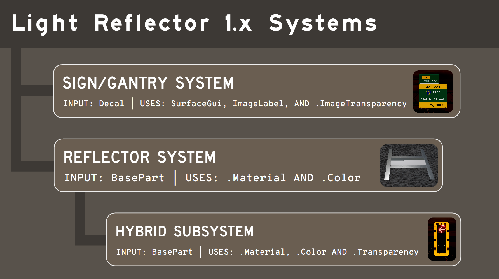

# Light Reflector 
**Version: 1.0.0-alpha.2**

 **A vehicle-based light reflector system that reflects `Decals` and `BasePart` reflectors at long distances on roads.**

[](https://opensource.org/licenses/MPL-2.0) [](https://codeberg.org/project-roadwork/light-reflector.git) [](https://github.com/project-roadwork/light-reflector.git) 


> [!NOTE]
> ****Please use the main repository especially with contributions or commits!*** *Additionally, please **DO NOT** make any changes in the mirrored repository as it cannot be pulled into the main repo.**
> 
> **The main repository is in Codeberg; however, I provided a *push* mirror on GitHub (pulls are not supported). Open an issue in Codeberg if you have concerns with this.**


> [!WARNING]
> **This script is under `alpha` and some functions may not work correctly or be unstable. Additionally, there are no *external* documentation for this module at the moment.**

### Wally / Pesde Notice
**Older versions in Pesde AND Wally are not accurate! Accurate older releases are in Codeberg (not GitHub).**

**Additionally, the published packages are broken with version mismatching.**

*Additionally, this is my first time using Pesde AND Wally - apologies if something is not formatted correctly.*

### Issues
1. **Broken Wally and Pesde packages, with mismatched versioning**
   * The Pesde package has version issues as well due to my custom pre-release tag `infdev`
2. **Rojo may not work correctly?**
3. **Possible BasePart memory leak on games with Instance Streaming**
4. **Many `:GetAttribute` calls popping up in the Microprofiler**
5. **No external documentation**
6. **Some signs and reflectors may not work at all in very rare occasions**

## Global features
1. Adaptive waiting on performance-critical functions
2. Distance fall-off
3. Angle-based brightness
4. Multi-vehicle support
5. Non-tweened fading/transitions for gradual brightness
6. Option to use `Tags` with `CollectionService`

## Sign/Gantry System Features
1. Utilizes `SurfaceGuis` and `ImageLabel` for reflectivity
2. Uses `.ImageTransparency`, `.Brightness`, and `.LightInfluence`
3. SurfaceGui pooling to increase performance
4. Automatic sign `:Dot` support
   * This determines if the vehicle is facing the sign or not to determine reflectiveness
5. Automatic part rotation for `Top` faces
   * Part rotation is needed since the orientation of images in `Decals` and `SurfaceGuis` are NOT the same
   * This may break the visuals of actual non-square parts due to rotations
6. Best for large reflective highway signs on gantries

## Reflector System Features
1. Utilizes `BaseParts` for reflectivity
2. Uses `.Color` and `.Material`
3. Wedge `:Dot` support, with face (`Enum.NormalId`) selection on non-wedges
   * This determines if the vehicle is facing the part or not to determine reflectiveness
4. Best for pavement reflectors on the road

### Hybrid System Features
1. Works alongside the Reflector System with no separate loop needed
2. Uses `.Color`, `.Material`, AND `.Transparency` with similar equations to the Sign/Gantry System
3. Face (`Enum.NormalId`) selection
4. Best for reflective traffic light shields, non-decal signs, etc.

## Essential Public API
1. `.Start()` - Starts the module
2. `.Cleanup()` - Resets states and cleans up the module
3. `.Configure({})` - Parses user configuration before starting (if you cannot do it IN the module first)
4. `.RegisterVehicle(car: Instance, isHeadlightEnabled: () -> boolean, getIntensity: () -> number)` - Registers vehicles into the module
5. `.UnregisterVehicle(car: Instance)` - Unregisters vehicles from the module

## Example Usage
```lua
local LightReflector = require(path.to.module)

local function determineIntensity(car)
  local finalIntensity = 1
-- logic to see if high beams are enabled or not (thus increase the intensity)
  return finalIntensity
end

LightReflector.Configure({
  -- make any config changes here
})

LightReflector.Start()

workspace.Cars.ChildAdded:Connect(function(car)
	if car:IsA("Model") and car:FindFirstChildOfClass("VehicleSeat") then
		print("Indexed Vehicle")
		LightReflector.RegisterVehicle(car, true, determineIntensity) -- true is the placeholder of what "enables" the light source like a Headlight boolean value
	end
end)

workspace.Cars.ChildRemoved:Connect(function(car)
	if car:IsA("Model") and car:FindFirstChildOfClass("VehicleSeat") then
		LightReflector.UnregisterVehicle(car)
	end
end)
```
**Other examples such as server pre-tagging and a vehicle handler are provided in the examples folder.**

## Systems Diagram


## Older YouTube Showcase
***Not up to date, uses 0.1.x***
[](https://www.youtube.com/watch?v=YK-_NzeLqjI)


## Contributing
**This section exists due to the file-level copyleft nature of the Mozilla Public License 2.0.**

*By contributing to this project, you agree that your contributions may be redistributed and relicensed by this project under other open-source and/or open-content licenses in the future (such as Apache-2.0).*

**View the reason why this clause exists in [./CONTRIBUTING.md](CONTRIBUTING.md)**

## License
**License: [Mozilla Public License 2.0](https://mozilla.org/MPL/2.0/) (open source).** 

*This may be changed to a more permissive license in the future if most people seem uncomfortable with it.*

> [!NOTE]
> ### Mozilla Public License 2.0 Summary
> **Warning: This summary does NOT act as a subsitute for the entire legal text. This is also not legal advice**
> 
> * **The Mozilla Public License 2.0 (MPL-2.0) is a weak copyleft license**
> 
> * **You must make any changes you made to the MPL covered files available under the MPL**
> * ***You can use the code in your games as long as you keep the MPL covered files open sourced under MPL in separate files***
>   * *You do **NOT** have to disclose the source of your entire game unlike the GPL-2.0 license, **only the MPL covered files ITSELF***


### License Comparison (not legal advice)

| Feature / License        | Expact (aka "MIT")    | Apache 2.0 | MPL 2.0       | GPL / AGPL v3               |
| ------------------------ | ------ | ---------- | ------------- | ------------------------ |
| **Permissive**           | ✅      | ✅          | ℹ️ Partial    | ❌                        |
| **Patent Clause**         | ❌      | ✅          | ✅             | ✅                        |
| **Proprietary Use OK**   | ✅      | ✅          | ✅¹           | ❌  (Must release whole source)                       |
| **Roblox Asset Usage**   | ✅      | ✅          | ℹ️ Depends; must share any changes    | ❌ May violate terms      |

* ¹ Proprietary use in MPL is permitted (allowed) as long as the MPL-covered files remain open souce.


