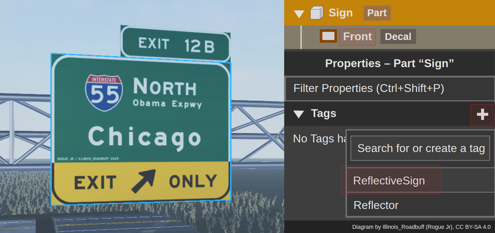
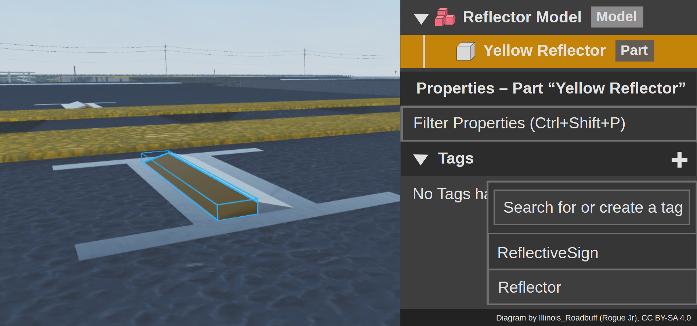
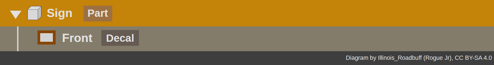
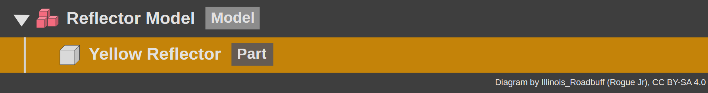

## Tags

Tags are the most recommended way to register/unregister signs and reflectors for both fresh and existing projects. It allows to find certain objects regardless of their location in the workspace, AND filters out other objects that may otherwise cause overhead.

Tags should be applied to signs and reflectors BEFORE the module starts.

### Method 1: Fresh Project

**If you are starting a fresh project, you should add tags to sign models and reflectors within road segments before you start building.**

**Please ensure that the decal with the sign image is named `Front` so the system knows which is the main decal. This is only needed if there are multiple decals in each part; however, it is not needed should the part only have one decal.**





NOTE: The default tag for signs is `ReflectiveSign` whereas the default tag for reflectors is `Reflector`. If you changed the configuration for tags, *you may have a different tag name.*

### Method 2: Existing Project

**Should you have an existing project with already built signs and reflectors WITHOUT tags, you can add tags during runtime in the server.**

If you already have unique identifiers (`Size`, `Color`, `Name`, etc.) for signs and reflectors, this method should be easy for you.

**Example 1:** Signs | Make a script that adds a tag to a part if it matches with a unique identifier (in this case, `Name`)



```luau
-- handler.server.luau

local CollectionService = game:GetService("CollectionService")
local signFolder = workspace.Signs
local signTagName = "ReflectiveSign"

for index: number, part: Instance in signFolder:GetDescendants() do
    if part:IsA("BasePart") and part.Name == "Sign" then
        CollectionService:AddTag(part, signTagName)
    end
end
```

**Example 2:** Reflectors | Make a script that adds a tag to a part if it matches with a unique identifier (in this case, `Name`)



```luau
-- handler.server.luau

local CollectionService = game:GetService("CollectionService")
local roadFolder = workspace.Roads
local reflectorTagName = "Reflector"

for index: number, part: Instance in roadFolder:GetDescendants() do
    if part:IsA("BasePart") and part.Name == "Reflector" then
        CollectionService:AddTag(part, reflectorTagName)
    end
end
```
***A completed sample can be found at `root/examples/tag-reflector.server.luau`!***

## Next, learn about registering signs and reflectors without tags!

---

[Previous Page](./004_vehicles.md) | [Next Page](./006_nontags.md)
