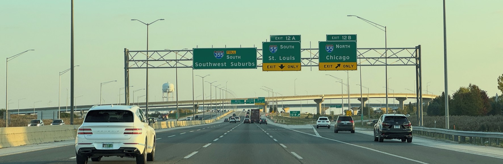
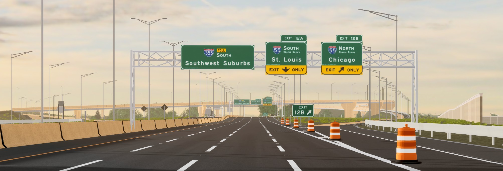

## Signs (general)

> [!NOTE]
> All images herein are taken by Illinois_Roadbuff (both in real life and his games), and do not come from other sources.

[Road] signs are a visual indicator that communicate information to drivers. 

.tif)

#### Clicking this picture will redirect you to Wikimedia Commons

In games, it would usually be displayed as a part with an image.

## Sign System

The sign system processes signs and renders them via two render modes:

1. Decal
2. SurfaceGui

### Decal Renderer

The decal renderer utilizes a `Decal` by itself to reflect by increasing the decal's base `Color3` above (255, 255, 255).

**Benefits:**
1. Appears more sharp when viewed at an angle
2. Orientation is preserved on meshes or unions
3. Probably more light-weight as no `SurfaceGui`s need to be created

**Cons:**
1.  Sign may appear overwhelmingly bright when faced uprfront
2.  Materials such as `Metal` will make the decal appear distorted

### SurfaceGui Renderer

The SurfaceGui renderer utilizes a `SurfaceGui` with an `ImageLabel` to reflect by using `.Brightness`, `.LightInfluence`, and `.ImageTransparency`.

**Benefits:**
1.  Prevents the sign from appearing extremely bright
2.  Can be applied to every material

**Cons:**
1.  Appears slightly blurred when viewed at an angle
2.  Orientation may be distorted or incorrect on meshes or unions

### Next, learn about reflectors in general!
