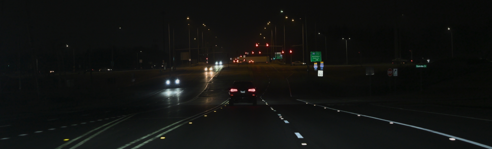
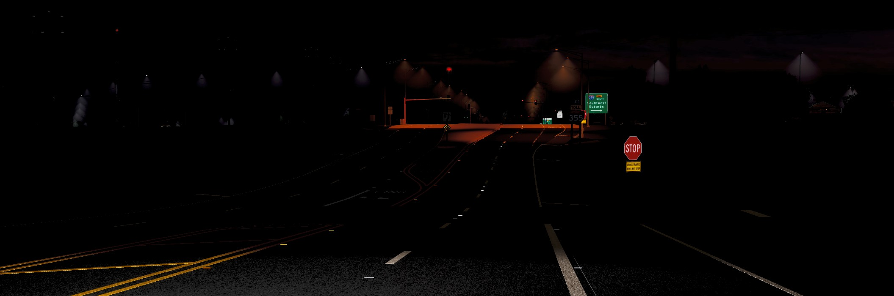
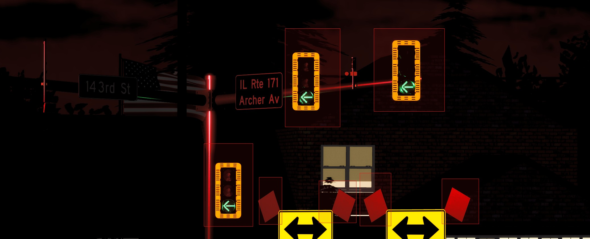
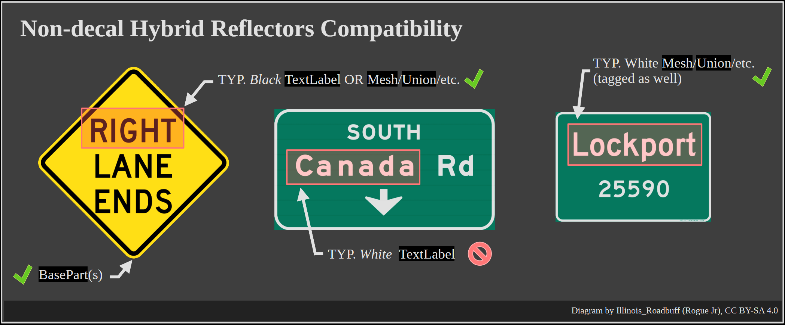

## Reflectors (general)

> [!NOTE]
> All images herein are original and freely licensed. In-game screenshots are provided for illustrative purposes.

[Road] reflectors are safety devices that reflect by vehicle headlights.

|  | 
|:--:| 
| *Real-world example: North Illinois Route 171 during night in Lockport, Illinois (March 2026)* |
| Image by Illinois_Roadbuff, under [CC BY-SA 4.0](https://creativecommons.org/licenses/by-sa/4.0/deed.en) |

In games, it may usually be displayed as using glowing materials.

|  | 
|:--:| 
| *In-game representation of road reflectors based in Illinois Route 171* |
| Image by Illinois_Roadbuff, under [CC BY-SA 4.0](https://creativecommons.org/licenses/by-sa/4.0/deed.en) |

## Hybrid Reflectors

Hybrid reflectors are an implementation within the Light Reflector system that *incorporates* logic in the `Sign` system. 

Since standard reflectors may transition unsmoothly when enlarged, the base reflector is cloned and uses `.Transparency` to transition smoothly. 

They are best for reflective traffic light shields, reflective flags, and non-decal signs; however, they should not be used on too many parts clustered in one area.

|  | 
|:--:| 
| *In-game representation of reflective traffic light shields in the 143rd Street and IL Route 171 intersection. Highlighted in red includes hybrid reflectors.* |
| Image by Illinois_Roadbuff, under [CC BY-SA 4.0](https://creativecommons.org/licenses/by-sa/4.0/deed.en) |

| _02.jpg) | 
|:--:| 
| *Real-world example: New traffic lights in the IL Route 53 and IL Route 7 intersection at Lockport, Illinois (November 2025).* [Image source](https://commons.wikimedia.org/wiki/File:New_Traffic_Signals_in_Lockport,_Illinois_(November_2025)_02.tif) |
| Image by Illinois_Roadbuff, under [CC BY 4.0](https://creativecommons.org/licenses/by/4.0/deed.en) at Wikimedia Commons |

Note that non-decal signs used as hybrid reflectors MUST have dark text (such as a standard U.S. MUTCD warning sign) to maintain readability. Manipulating the brightness of `SurfaceGui`s, `TextLabel`s, AND the sign part(s) concurrently will put a massive strain on performance.

## Systems

### Base Reflector System
The base reflector system uses `.Color` and `.Material` on `BasePart`s to mimic reflectance. Before changing a part to neon, the original `BasePart` `Color3`'s are normalized into a lighter/darker color so dark-colored reflectors will not look too dark when the material is set to `Neon`, and vice versa for light-colored reflectors.

### Hybrid Subsystem
The hybrid subsytem extends the base system by incorporating `.Color`, `.Transparency`, and `.Material` on reflector clones to mimic reflectance.

## Next, learn about configuration overrides per part/entity!

---

[Previous Page](../007_signs.md) | [Next Page](../009_overrides.md)
